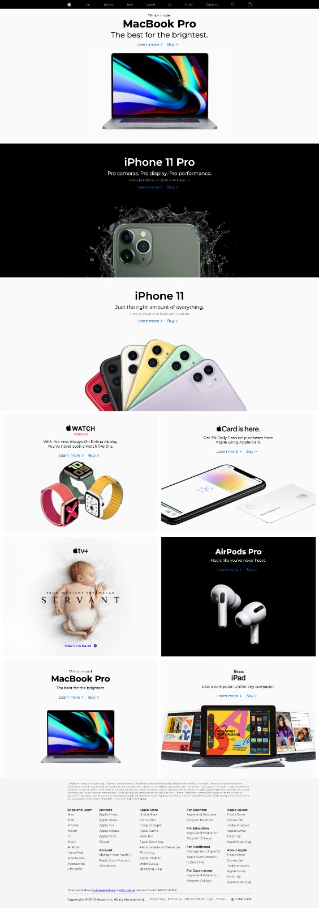

# 🍎 Apple Responsive Replica

A collaborative project to recreate a **responsive version of Apple’s homepage** using **HTML, CSS (Bootstrap + custom), and JavaScript**.
This project follows Git and GitHub best practices for teamwork — each member works on a branch, commits frequently, and submits pull requests for review.

---

## 🧱 Folder Structure

```
appleStart/
│
├── css/
│   ├── bootstrap.css       # Bootstrap framework styles
│   └── styles.css          # Custom project styles
│
├── js/
│   ├── bootstrap.js        # Bootstrap JS library
│   ├── jQuery.js           # jQuery dependency
│   └── script.js           # Custom JS (currently empty)
│
├── images/
│   ├── home/               # Main page images
│   ├── icons/              # Icons like favicon, logos
│   ├── apple-home-page-desktop-design.jpeg
│   └── apple-home-page-mobile-design.jpeg
│
├── index.html              # Main HTML file
└── README.md               # Project documentation
```

---

## 👥 Team & Tasks

| Section                | Branch Name Example | Description                         |
| ---------------------- | ------------------- | ----------------------------------- |
| Header                 | `header`            | Navigation bar and Apple logo links |
| First Section          | `macbook-pro`       | 16-inch MacBook Pro section         |
| Second Section         | `iphone-11-pro`     | iPhone 11 Pro section               |
| Third Section          | `iphone-11`         | iPhone 11 section                   |
| Fourth Section (Left)  | `watch`             | Apple Watch – Series 5              |
| Fourth Section (Right) | `card`              | Apple Card                          |
| Footer                 | `footer`            | Footer links, copyright, etc.       |

---

## 🧑‍💻 Getting Started

### 1. Clone the Repository

```bash
git clone https://github.com/<leader-username>/appleClone.git
cd appleClone
```

### 2. Create Your Branch

Each member creates a branch based on their task:

```bash
git checkout -b <branch-name>
```

Example:

```bash
git checkout -b header
```

### 3. Work on Your Section

Open `index.html`, locate your section comment (e.g., `<!-- Header navigation -->`), and add your HTML, CSS, and JS.

### 4. Stage and Commit

Commit frequently and clearly describe what changed.

```bash
git add .
git commit -m "Added header navigation section"
```

### 5. Pull and Push

Before pushing, always pull the latest version of `main` to avoid conflicts.

```bash
git pull origin main
git push -u origin <your-branch-name>
```

---

## 🔁 Code Review and Merging

1. Go to the **Pull Requests** tab on GitHub.
2. Create a PR from your branch → `main`.
3. Request review from the group leader.
4. After review and conflict resolution, the leader merges it into `main`.

---

## ⚔️ Resolving Merge Conflicts

If two members edit the same file:

1. Git will show conflict markers like:

   ```
   <<<<<<< HEAD
   your code
   =======
   teammate code
   >>>>>>> branch-name
   ```
2. Manually keep the correct version.
3. Save → Stage → Commit:

   ```bash
   git add .
   git commit -m "Resolved merge conflict in index.html"
   ```

---

## ⏪ Reverting to Stable Version

If something breaks after merging:

```bash
git log               # find the stable commit ID
git revert <commit-id>
```

---

## 📄 Tools Used

* **HTML5** — Structure
* **CSS3 & Bootstrap** — Styling and responsiveness
* **JavaScript & jQuery** — Interactivity

---

## 🧠 Best Practices

* Use **descriptive branch names** (`header`, `footer`, etc.)
* **Commit often** with small, clear changes
* **Never push directly to main**
* **Pull before pushing** every time
* Add clear comments in code for teamwork

---

## 📸 Design References

| Desktop View                                                  | Mobile View                                                 |
| ------------------------------------------------------------- | ----------------------------------------------------------- |
|  |  |

---
## 🙌 Credits

Developed collaboratively by our **Evangadi Web Development Group**.

**Group Leader:** [Desalegn Tamirat](https://github.com/DesalegnTamirat)

**Collaborators:**

* [Moges Sisay](https://github.com/Moges741)
* [Tewobsta Migbar](https://github.com/Tewobsta13)
* [Abdulkaf Nesru](https://github.com/Abdulkafnesru)
* [Rediet Befkadu](https://github.com/redietbefkadu)
